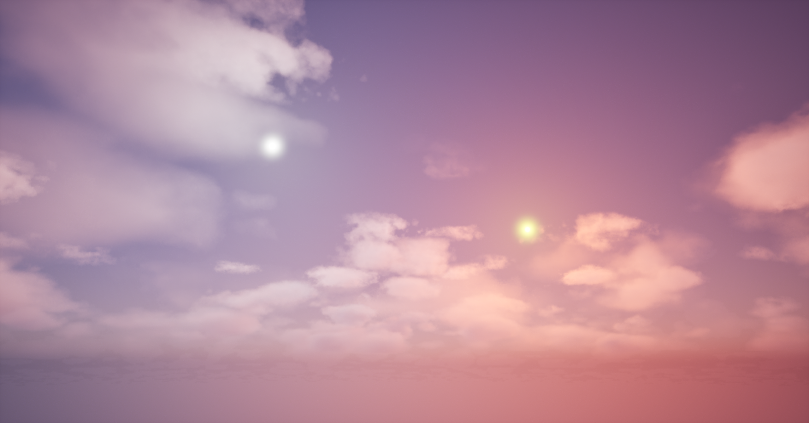

# ☀️ Playing with Skies in Unreal Engine 5.6  

As part of the **"Unreal Engine 5 C++ The Ultimate Game Developer Course"** (Section 2: Lighting and Atmosphere), I built this blank scene and experimented with:  

✅ Volumetric Clouds  
✅ Exponential Height Fog  
✅ Sky Atmosphere  
✅ Two Directional Lights *(tweaking their color temperatures to get this warm/cool contrast)*  

---

## 🌌 What I Learned  
- How a few simple elements can transform an empty level into something alive  
- The importance of **atmospheric lighting** for mood and depth  
- How **color temperature** dramatically shifts the vibe of a scene  

---

## 🖼 Preview  
  

---

## 🔧 Tools & Tech  
- Unreal Engine **5.6**  
- C++ (course context)  
- Lighting & Rendering Systems  

---

## 🔖 Tags  
`#UnrealEngine` `#UE5` `#GameDev` `#Lighting` `#LevelDesign` `#Rendering`  

---

✨ *It’s amazing how just a few tweaks in lighting can make an empty scene feel alive.*  
